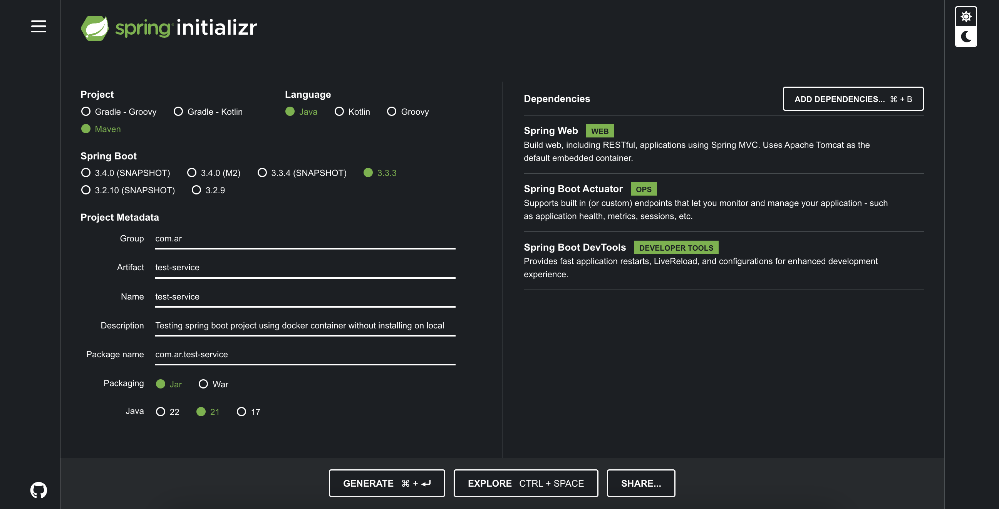
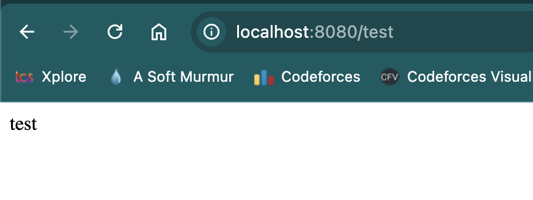

#### Step 1: Generate a project using spring initializr



#### Step 2: Unzip the download project and move into the desired path

#### Step 3: Write docker file

```
# 1

# FROM maven:3.9.8-amazoncorretto-21
FROM maven:3.9.8-amazoncorretto-21

WORKDIR /service

COPY test-service/pom.xml ./

COPY test-service/src ./src
RUN mvn clean package

EXPOSE 8080

CMD ["java", "-jar", "/service/target/test-service-0.0.1-SNAPSHOT.jar"]

```
---
```
# 2

# Stage 1: Build
FROM maven:3.9.8-amazoncorretto-21 AS build

# Set the working directory
WORKDIR /service

# Copy the pom.xml file and the source code
COPY test-service/pom.xml ./
COPY test-service/src ./src

# List files and directories after copying the files
RUN ls -l

# Build the project
RUN mvn clean package

# List all files and directories in the /service directory after building
RUN ls -l /service/target

# Stage 2: Run
FROM amazoncorretto:21-alpine

# Set the working directory in the run stage
WORKDIR /service

# Copy the JAR file from the build stage
COPY --from=build /service/target/test-service-*.jar /service/test-service.jar

# List all files and directories in the /service directory in the run stage
RUN ls -l /service

# Expose port 8080
EXPOSE 8080

# Run the JAR file
CMD ["java", "-jar", "/service/test-service.jar"]
```
---
```
# 3

# Stage 1: Build
FROM maven:3.9.8-amazoncorretto-21 AS build

WORKDIR /service
COPY test-service/pom.xml ./
COPY test-service/src ./src
RUN mvn clean package

# Stage 2: Run
FROM amazoncorretto:21-alpine

WORKDIR /service
COPY --from=build /service/target/test-service-*.jar /service/test-service.jar
EXPOSE 8080
CMD ["java", "-jar", "/service/test-service.jar"]
```

#### Step 4: Write compose file

```
services:
  backend:
    build: .
    ports:
      - "8080:8080"
    volumes:
      - .:/app
    environment:
      - JAVA_OPTS=-Xmx512m
```

#### Step 5: Build & Run compose file

```
docker compose build
docker compose build --no-cache
docker compose up
docker compose up -d
```

# Verify locally using browser or curl

localhost:8080


